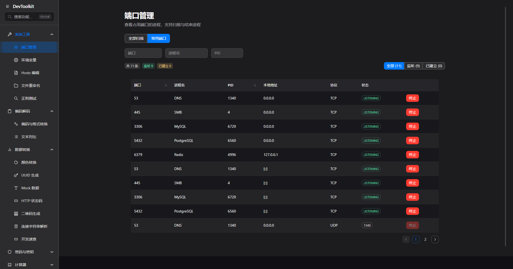
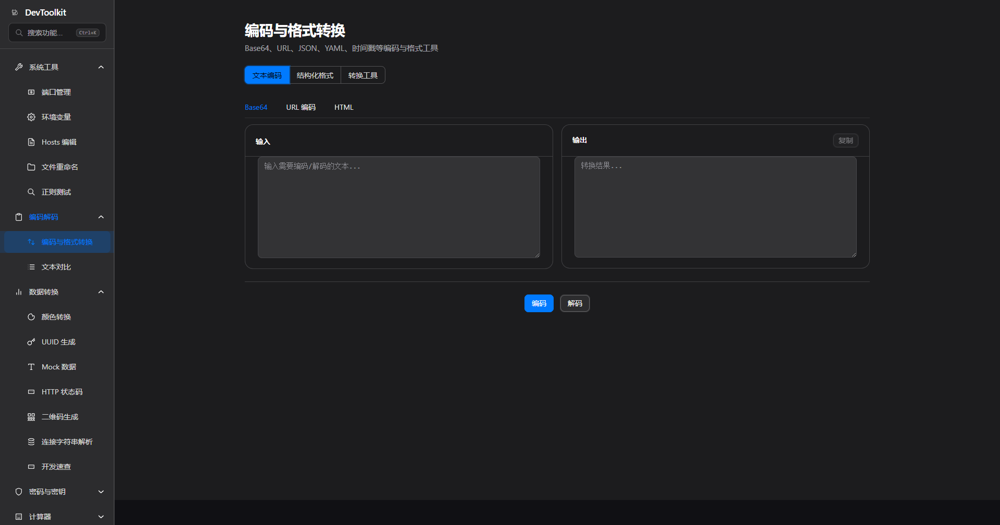
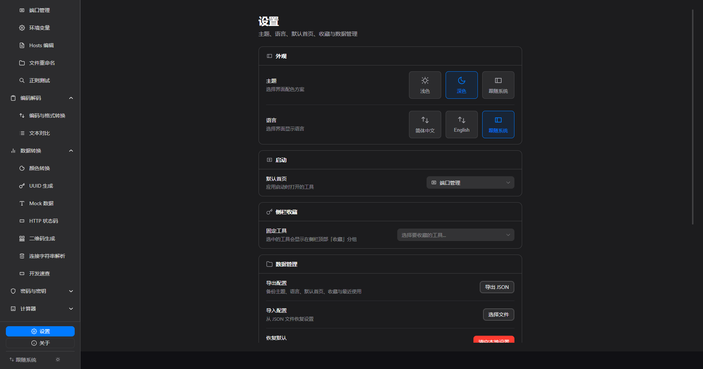

# Dev Tool Kit

<p align="center">
  <strong>小而美 · 本地优先 · 开发者工具箱</strong>
</p>

<p align="center">
  一款追求极简与优雅的桌面开发者工具集，灵感源于 Apple 设计哲学
</p>

<p align="center">
  中文文档 | <a href="README_EN.md">English Documentation</a>
</p>

## 界面预览

以下为代表性界面截图（端口管理、编码转换、设置）。应用内共 **22 个工具**，完整列表见下方 [功能概览](#功能概览)。





## 设计理念

**小而美** — 每个工具页面专注做好一件事；通过搜索与聚合入口避免重复，侧栏保持清晰。

**本地优先** — 所有功能完全在本地运行，无需网络连接。你的数据始终在你的设备上，隐私安全有保障。

**优雅体验** — 参考 Apple Human Interface Guidelines，追求简洁的界面、流畅的动画、直觉的操作。

**语言支持** — 完整的双语支持（中文和英文），应用内无缝切换语言。

## 功能概览

### 系统工具

| 工具 | 说明 |
|------|------|
| 端口管理 | 本地端口扫描、常用端口、进程终止（Windows 完整支持；macOS/Linux 可终止用户进程） |
| 环境变量 | Windows 用户/系统变量读写、PATH、备份与导入导出；macOS/Linux 读取并写入 Shell 配置（备份 + diff 预览） |
| Hosts 编辑 | hosts 可视化管理、分组、方案 diff、导入导出、DNS 刷新；权限不足时提示 sudo 命令 |
| 文件重命名 | 批量重命名、规则链、正则替换、撤销、规则库、冲突预览 |
| 正则测试 | 正则匹配、替换预览（支持 flags）、常用表达式库 |

### 编码解码

| 工具 | 说明 |
|------|------|
| 编码与格式转换 | Base64、URL、JSON（树形 + Schema）、YAML、TOML、XML、SQL、时间戳、进制、命名、HTML、图片 Base64（统一入口，Tab 记忆） |
| 文本对比 | 逐行/逐词 Diff，文件导入，忽略空白/大小写，统一/并排视图 |

### 数据转换

| 工具 | 说明 |
|------|------|
| 颜色转换 | HEX、RGB、HSL、HSV 互转，WCAG 对比度检测 |
| UUID 生成 | 批量生成 UUID/GUID |
| Mock 数据 | 预设模板、丰富字段类型、按字段生成 JSON、导出 JSON/CSV/SQL INSERT |
| HTTP 状态码 | 62 个常用状态码速查、搜索与分类 |
| 开发速查 | MIME 类型、Git 命令模板、HTTP 方法离线速查（Tab 深链） |
| 二维码生成 | 文本/URL 本地生成二维码，可调尺寸与纠错级别 |
| 连接字符串解析 | MySQL、PostgreSQL、Redis、MongoDB URI 解析，字段表与 JSON 导出 |

### 密码与密钥

| 工具 | 说明 |
|------|------|
| 密码生成 | 随机字符密码与离线词组口令（Diceware） |
| JWT 工具 | Secret 生成、Token 解码/签发、HMAC 与 RSA 公钥验签 |
| Hash 生成 | MD5、SHA-1、SHA-256、SHA-512；文本与文件哈希 |
| 证书解析 | PEM/X.509 证书本地解析，查看主题、颁发者、有效期、指纹等 |
| 密钥对生成 | RSA 2048/4096、EC P-256/P-384 本地生成，PEM 导出，可跳转 JWT 验签 |

### 计算器

| 工具 | 说明 |
|------|------|
| Cron 解析 | 可视化字段编辑、本地时区、接下来 5 次执行时间与相对倒计时 |
| 子网计算 | IPv4/IPv6 CIDR，VLSM 子网拆分，输出网络/广播/掩码/主机范围 |
| Chmod 计算 | 八进制/符号权限互转，rwx 位可视化 |

## 快捷操作

### 全局

- `Ctrl+K` — 打开/关闭全局搜索（支持深链到编码转换、开发速查等子 Tab）
- 搜索浮层：`↑` / `↓` 移动，`Enter` 打开，`Esc` 关闭

### 页面内

- `Ctrl+Shift+C` — 双栏工具页复制输出（Hash、编码转换等）
- `Ctrl+Enter` — 编码与格式转换页执行当前 Tab 主操作
- `R` — 端口管理页刷新扫描（非输入框聚焦时）

### 其他

- 侧栏底部 — 设置 / 关于；顶栏 — 主题切换（浅色 · 深色 · 跟随系统）
- 设置页 — 配置侧栏收藏、默认首页、主题、配置导入导出

完整快捷键列表见应用内 **关于** 页。

## 平台能力矩阵

| 功能 | Windows | macOS | Linux | 说明 |
|------|---------|-------|-------|------|
| 端口扫描 | 完整支持 | 完整支持 | 完整支持 | — |
| 终止占用进程 | 完整支持 | 部分支持 | 部分支持 | Unix 下可终止用户进程；系统进程可能需 sudo |
| 环境变量管理 | 完整支持 | 部分支持 | 部分支持 | Unix 可写入 Shell 配置（自动备份）；Windows 写入注册表 |
| Hosts 编辑 | 部分支持 | 部分支持 | 部分支持 | 写入可能需管理员权限；失败可复制 sudo 命令 |
| DNS 刷新 | 完整支持 | 完整支持 | 部分支持 | Linux 依赖 systemd-resolve / nscd |
| 文件重命名 | 完整支持 | 完整支持 | 完整支持 | — |
| 编码 / Hash / JWT 等 | 本地可用 | 本地可用 | 本地可用 | 渲染进程本地计算，全平台一致 |

## 深链路由

| 路径 | 目标 |
|------|------|
| `/base64` | 编码转换 · Base64 Tab |
| `/url` | 编码转换 · URL Tab |
| `/yaml` | 编码转换 · YAML Tab |
| `/toml` | 编码转换 · TOML Tab |
| `/json-formatter` | 编码转换 · JSON Tab |
| `/timestamp` | 编码转换 · 时间戳 Tab |
| `/xml` | 编码转换 · XML Tab |
| `/sql` | 编码转换 · SQL Tab |
| `/image-base64` | 编码转换 · 图片 Base64 Tab |
| `/chmod-calculator` | Chmod 计算器 |
| `/http-status-codes` | HTTP 状态码速查 |
| `/connection-string-parser` | 数据库连接字符串解析 |
| `/dev-reference` | 开发速查（`?tab=mime` / `git` / `http-methods`） |
| `/key-pair-generator` | RSA/EC 密钥对生成 |
| `/certificate-parser` | 证书 PEM 解析 |
| `/qr-code-generator` | 二维码生成 |

## 技术栈

- **Electron** — 跨平台桌面应用框架
- **Vue 3** — 渐进式 JavaScript 框架
- **Naive UI** — Vue 3 组件库
- **TypeScript** — 类型安全的 JavaScript 超集
- **Vite** — 下一代前端构建工具

## 快速开始

### 环境要求

- Node.js >= 18.0.0（CI 使用 Node 20+）
- pnpm >= 9.0.0

### 安装依赖

```bash
pnpm install
```

### 开发模式

```bash
pnpm dev
```

### 构建应用

```bash
pnpm build
```

### 代码检查

```bash
pnpm lint
pnpm typecheck
pnpm test
pnpm check:locales
```

## 项目结构

Monorepo 架构: `apps/desktop` (Electron 应用) + `packages/shared` (共享工具模块)

## 为什么选择 Dev Tool Kit？

- **无网络依赖** — 内网环境、断网状态，随时随地使用
- **数据隐私** — 所有数据本地处理，不上传任何信息
- **启动快速** — 轻量级设计，秒开即用
- **原生体验** — 桌面应用原生性能，无浏览器限制
- **持续进化** — 更多实用工具持续加入中

## 许可证

[MIT](LICENSE)
