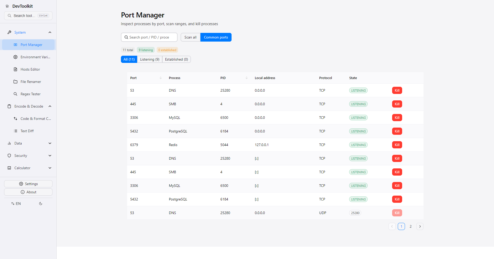
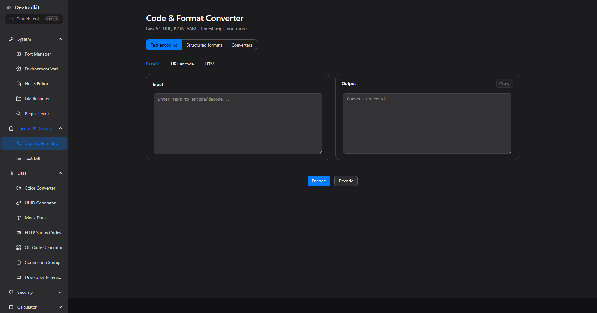
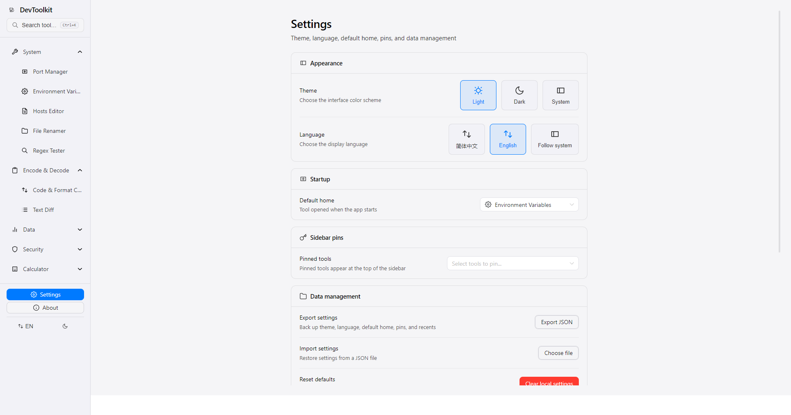

# Dev Tool Kit

<p align="center">
  <strong>Small & Beautiful · Local-First · Developer Toolkit</strong>
</p>

<p align="center">
  A desktop developer toolset pursuing minimalism and elegance, inspired by Apple's design philosophy
</p>

<p align="center">
  <a href="README.md">中文文档</a> | English Documentation
</p>

## Screenshots

Representative previews below (port manager, encoding converter, settings). The app includes **22 tools** in total — see [Features Overview](#features-overview) for the full list.





## Design Philosophy

**Small & Beautiful** — Each tool page focuses on doing one thing well; avoid duplication through search and aggregation entry, keep the sidebar clear.

**Local-First** — All features run completely locally, no network connection required. Your data always stays on your device, privacy and security guaranteed.

**Elegant Experience** — Following Apple Human Interface Guidelines, pursuing clean interfaces, smooth animations, and intuitive operations.

**Language Support** — Full bilingual support (Chinese & English) with seamless in-app language switching.

## Features Overview

### System Tools

| Tool | Description |
|------|------|
| Port Manager | Local port scanning, common ports, process termination (full on Windows; user processes on macOS/Linux; copy sudo command on failure) |
| Environment Variables | Windows user/system read-write, PATH, backup & export/import; macOS/Linux shell config write (shows target file, backup + diff preview) |
| Hosts Editor | Visual hosts management, grouping, scheme diff, export/import, DNS flush (Linux multi-tool fallback); disable save without write access, one-click sudo copy |
| File Renamer | Batch rename, rule chains, regex replace, undo, rule library, conflict preview |
| Regex Tester | Regex matching, replace preview with flags, common expression library |

### Encoding & Decoding

| Tool | Description |
|------|------|
| Encoding & Format Conversion | Base64, URL, JSON (tree + Schema), YAML, TOML, XML, SQL, timestamp, radix, naming, HTML, image Base64 (unified entry with Tab memory) |
| Text Diff | Line/word-level diff, file import, ignore whitespace/case, unified/split view |

### Data Conversion

| Tool | Description |
|------|------|
| Color Converter | HEX, RGB, HSL, HSV conversion with WCAG contrast check |
| UUID Generator | Batch generate UUID/GUID |
| Mock Data | Preset templates, rich field types, field-based JSON generation, export JSON/CSV/SQL INSERT |
| HTTP Status Codes | Quick reference for 62 common status codes with search and categories |
| Developer Reference | Offline MIME types, Git command templates, HTTP methods (tab deep links) |
| QR Code Generator | Generate QR codes locally from text/URL with adjustable size and error correction |
| Connection String Parser | Parse and build MySQL, PostgreSQL, Redis, MongoDB URIs; export JSON; link to Mock Data / Port Manager |

### Password & Keys

| Tool | Description |
|------|------|
| Password Generator | Random character passwords and offline passphrase (Diceware) |
| JWT Tool | Secret generation, token decode/sign, HMAC & RSA public-key verification |
| Hash Generator | MD5, SHA-1, SHA-256, SHA-512; text and file hashing |
| Certificate Parser | Local PEM/X.509 parsing — subject, issuer, validity, fingerprints, and more |
| Key Pair Generator | Local RSA 2048/4096 & EC P-256/P-384 key pairs, PEM export, link to JWT verify |

### Calculators

| Tool | Description |
|------|------|
| Cron Parser | Visual field editor, local timezone, next 5 execution times with relative countdown |
| Subnet Calculator | IPv4/IPv6 CIDR with VLSM splitting, network/broadcast/mask/host range |
| Chmod Calculator | Octal/symbolic permission conversion with rwx bit visualization |

## Keyboard Shortcuts

### Global

- `Ctrl+K` — Open/close global search (supports deep links to encoding conversion, developer reference tabs, etc.)
- Search overlay: `↑` / `↓` navigate, `Enter` open, `Esc` close

### In-Page

- `Ctrl+Shift+C` — Copy output in dual-panel tool pages (Hash, encoding conversion, etc.)
- `Ctrl+Enter` — Execute current tab's main action in encoding & format conversion page
- `R` — Refresh scan in port manager page (when not focused on input field)

### Others

- Sidebar bottom — Settings / About; Top bar — Theme switch (Light · Dark · System)
- Settings page — Configure sidebar favorites, default homepage, theme, config export/import

Full keyboard shortcuts list available in the app's **About** page.

## Platform Capability Matrix

| Feature | Windows | macOS | Linux | Notes |
|---------|---------|-------|-------|-------|
| Port Scanning | Full Support | Full Support | Full Support | — |
| Kill Process | Full Support | Partial Support | Partial Support | Unix can kill user processes; system processes may need sudo |
| Environment Variables | Full Support | Partial Support | Partial Support | Unix shell config write with backup; Windows registry write |
| Hosts Editor | Partial Support | Partial Support | Partial Support | Write may require admin; sudo command copy on failure |
| DNS Flush | Full Support | Full Support | Partial Support | Linux depends on systemd-resolve / nscd |
| File Renamer | Full Support | Full Support | Full Support | — |
| Encoding / Hash / JWT etc. | Local Available | Local Available | Local Available | Renderer process local computation, consistent across platforms |

## Deep Link Routes

| Path | Target |
|------|------|
| `/base64` | Encoding Conversion · Base64 Tab |
| `/url` | Encoding Conversion · URL Tab |
| `/yaml` | Encoding Conversion · YAML Tab |
| `/toml` | Encoding Conversion · TOML Tab |
| `/json-formatter` | Encoding Conversion · JSON Tab |
| `/timestamp` | Encoding Conversion · Timestamp Tab |
| `/xml` | Encoding Conversion · XML Tab |
| `/sql` | Encoding Conversion · SQL Tab |
| `/image-base64` | Encoding Conversion · Image Base64 Tab |
| `/chmod-calculator` | Chmod Calculator |
| `/http-status-codes` | HTTP Status Codes Reference |
| `/connection-string-parser` | Connection string parse & build |
| `/dev-reference` | Developer Reference (`?tab=mime` / `git` / `http-methods`) |
| `/key-pair-generator` | RSA/EC Key Pair Generator |
| `/certificate-parser` | Certificate PEM Parser |
| `/qr-code-generator` | QR Code Generator |

## Tech Stack

- **Electron** — Cross-platform desktop application framework
- **Vue 3** — Progressive JavaScript framework
- **Naive UI** — Vue 3 component library
- **TypeScript** — Type-safe JavaScript superset
- **Vite** — Next-generation frontend build tool

## Quick Start

### Prerequisites

- Node.js >= 18.0.0 (CI uses Node 24)
- pnpm >= 9.0.0

### Install Dependencies

```bash
pnpm install
```

### Development Mode

```bash
pnpm dev
```

### Build Application

Development build (outputs to `apps/desktop/out`, no installer):

```bash
pnpm build
```

### Building Installers

Package unsigned installers for the current platform locally (install dependencies first):

```bash
pnpm install
pnpm dist          # Full installer for current OS (Windows NSIS / macOS DMG / Linux AppImage)
pnpm dist:dir      # Unpacked directory only — quick packaging smoke test
pnpm dist:win      # Windows only
pnpm dist:mac      # macOS only (requires macOS host, or use CI)
pnpm dist:linux    # Linux only
```

Artifacts are written to `apps/desktop/dist/`.

**Unsigned release notes:**

- **Windows** — Installers are not code-signed. SmartScreen may warn about an unknown publisher on first run; choose "Run anyway".
- **macOS** — The app is not notarized. On first launch, right-click → Open, or allow it under System Settings → Privacy & Security.
- **Linux** — Make the AppImage executable and run: `chmod +x DevToolkit-*.AppImage && ./DevToolkit-*.AppImage`

Pre-built installers are available on [GitHub Releases](https://github.com/blueWhalei/dev-tool-kit/releases).

### Cutting a Release

Maintainers trigger CI to build all three platforms and publish to GitHub Releases (no signing certificates required):

```bash
git tag v1.0.0
git push origin v1.0.0
```

You can also run the **Release** workflow manually from GitHub Actions and provide a version tag.

### Code Quality

```bash
pnpm lint
pnpm typecheck
pnpm test
pnpm check:locales
```

## Project Structure

Monorepo architecture: `apps/desktop` (Electron app) + `packages/shared` (shared utility modules)

## Why Choose Dev Tool Kit?

- **No Network Dependency** — Works in intranet environments, offline state, anytime anywhere
- **Data Privacy** — All data processed locally, no information uploaded
- **Fast Startup** — Lightweight design, instant launch
- **Native Experience** — Desktop app native performance, no browser limitations
- **Continuous Evolution** — More practical tools continuously being added

## License

[MIT](LICENSE)
